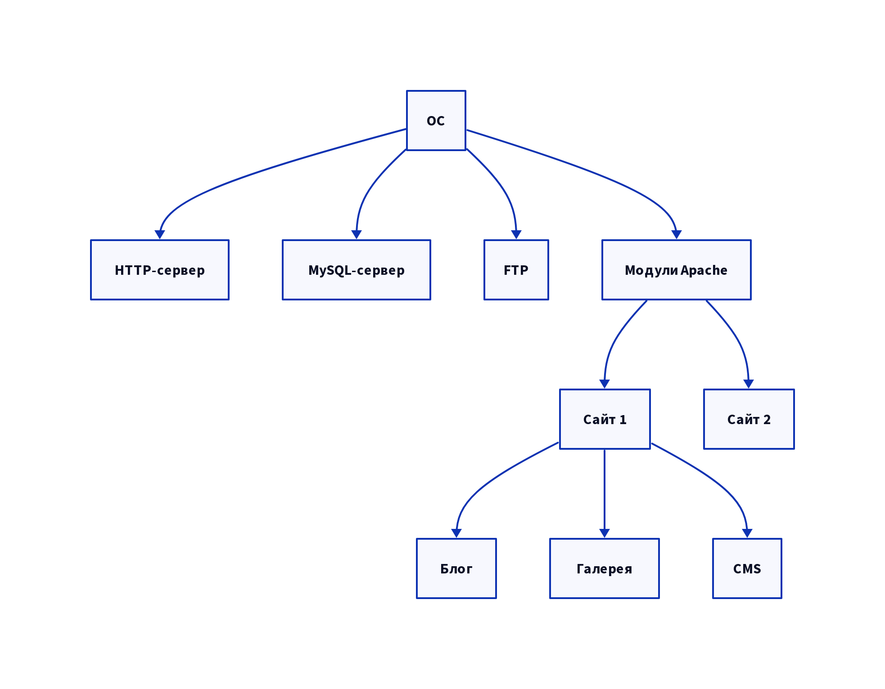

# Основы безопасности

**Первый этап проектирования, создания или использования безопасного сайта** - обеспечение максимального уровня безопасности сервера, на котором он размещается

Веб-сервер формируется несколькими слоями ПО, каждый из которых подвержен разнообразным способам атак


```d2
OC -> HTTP-сервер
OC -> MySQL-сервер
OC -> FTP
OC -> Модули Apache
Модули Apache -> Сайт 1
Модули Apache -> Сайт 2
Сайт 1 -> Блог
Сайт 1 -> Галерея
Сайт 1 -> CMS
```

Основа любого сервера - это ОС. Обеспечить ее безопасность сравнительно просто: достаточно вовремя устанавливать обновления системы безопасности. Это не трудоемкое и автоматизированное занятие

**Следующий важный момент** - антивирусы. Они являются обязательным требованием для любого сервера.

# Internet Information Services (IIS)

**IIS** - компонент Microsoft Windows, популярный и распространенный веб-сервер.
При его развертывании помните:

- отключить неиспользуемые системы
- Отключить просмотр каталогов
- Отключить серверный FrontPage

# HTTP-сервер Apache

**Apache** - веб-сервер с открытым кодом, широкими возможностями конфигурации и высоким уровнем поддержки.
Для его развертывания нужна более детальная настройка.
Работает на Linux и FreeBSD

# PHP и MySQL

PHP является одним из наиболее распространенных серверных скрптовых языков. У него обширная база функционального кода, простой синтаксис...
MySQL - популярная СУБД используемая с PHP причина в ее эффективности и простое настройки

# Настройка PHP и MySQL

В файле `php.ini`:

- `register_globals=off`
- `safe_mode=on`
- `open_basedir=(website basedir)`
- `display_errors=off`
- `log_errors=on`
